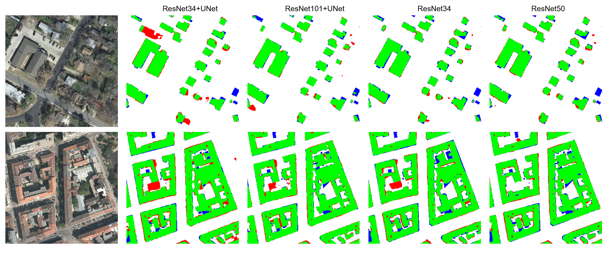

# Models for Remote Sensing

## Installation
### Dependencies
- PyTorch >= 1.1
- [TensorboardX](https://github.com/lanpa/tensorboardX)
- [TorchSummary](https://github.com/sksq96/pytorch-summary)
- [Albumentation](https://github.com/albu/albumentations)

## Demos
- [Object-wise scoring](./demo/object_scoring.ipynb)
- [Results visualization](./demo/results_visualization.ipynb)

## Pretrained Models
| Encoder Name | Decoder Name | Dataset   | Label    | Score (IoU) | Size    | Model |
|:------------:|:------------:|:---------:|:--------:|:-----------:|:--------|:-----:|
| VGG16        | UNet         | Inria     | Building | 78.56       | 207.3MB | [Box](https://duke.box.com/s/0y8bcxmsrqe5e3xjlaakytmvrwt7m5f7) |
| VGG19        | UNet         | Inria     | Building | 78.17       | 247.8MB | [Box](https://duke.box.com/s/ph3amubdy5vtl2mrzjrdc98qioks7z3y) |
| ResNet34     | UNet         | Inria     | Building | 77.06       | 204.2MB | [Box](https://duke.box.com/s/bceeabdfg31cl9uadiir8fdyrfk0aa2l) |
| ResNet50     | UNet         | Inria     | Building | 78.78       | 666.9MB | [Box](https://duke.box.com/s/nhvkbb6nqezjz40g19j9s2zfhjku8jjz) |
| ResNet101    | UNet         | Inria     | Building | 79.09       | 812.1MB | [Box](https://duke.box.com/s/d88bnmnkbmlhgpqfxws0w12xypijyk7t) |
| VGG16        | PSPNet       | Inria     | Building | 76.23       | 171.1MB | [Box](https://duke.box.com/s/4rhkj8ce4f90t967wh371bh1r66hos7k) |
| VGG19        | PSPNet       | Inria     | Building | 75.94       | 211.6MB | [Box](https://duke.box.com/s/fqevw4n6t8orszwh94smxiwwvp5jgfdd) |
| ResNet34     | PSPNet       | Inria     | Building | 76.11       | 221.2MB | [Box](https://duke.box.com/s/eu49tfvllgefxf8ergh1b8mv7y4vjifz) |
| ResNet50     | PSPNet       | Inria     | Building | 77.46       | 418.3MB | [Box](https://duke.box.com/s/kxm9r269csgxfosrui5jnqqir54ttd59) |
| ResNet101    | PSPNet       | Inria     | Building | 78.55       | 563.5MB | [Box](https://duke.box.com/s/zx2yfyrekvi0dk84l0qpo6xy5le1qsex) |
| ResNet34     | DLinkNet     | Inria     | Building | 75.67       | 248.5MB | [Box](https://duke.box.com/s/634lp66fd7s9wxphnvtr5l055xr57pas) |
| ResNet50     | DLinkNet     | Inria     | Building | 77.08       | 1.4GB   | [Box](https://duke.box.com/s/1tn7zcuvfknkxfdb9aa0lye0pyn8n056) |
| ResNet50     | UNet         | DeepGlobe | Building | 79.43       | 671.4MB | [Box](https://duke.box.com/s/dtzq771vkp20wyne0vaiwtrmcc0lrzyy) |
| ResNet101    | UNet         | DeepGlobe | Building | 79.43       | 671.4MB | [Box](https://duke.box.com/s/3caceshq6jhnyhn28rqdn4f7eg33ciq0) |
| ResNet101    | DeepLabV3+   | Inria     | Building | 79.17       | 464.6MB | [Box](https://duke.box.com/s/16wf4r4uylc493yo4w7b8qsvkvokznld) |
| ResNet34     | DLinkNet     | DeepGlobe | Road     | 62.15       | 253MB   | [Box](https://duke.box.com/s/hxxngisok3dainng2ald4viqnts1pmms) |

## Features
- [ ] Encoder Structures:
    - [X] [VGG](./network/backbones/vggnet.py)
    - [X] [ResNet](./network/backbones/resnet.py)
    - [ ] DenseNet
    - [x] [SqueezeNet](./network/backbones/squeezenet.py)
    - [x] [InceptionNet](./network/backbones/inception.py)
- [ ] Decoder Structures:
    - [X] [UNet](./network/unet.py)
    - [X] [DLinkNet](./network/dlinknet.py)
    - [X] [PSPNet](./network/pspnet.py)
    - [X] [DeepLabV3+](./network/deeplabv3.py)
- [X] Different Losses:
    - [X] Xent
    - [X] Jaccard Approximation
    - [X] Focal Loss
    - [X] Lovasz softmax (https://github.com/bermanmaxim/LovaszSoftmax/tree/master/pytorch)
    - [X] Weighted combination of arbitrary supported losses
- [X] Multi GPU Training
- [X] Evaluation
    - [X] Dataset Evaluator
    - [X] Evaluate Report & Prediction Map
- [X] Results visualization
- [X] Class weights on criterions

## Known Bugs
- [ ] Unable to do model-wise data parallel
- [ ] [Failed to load models that trained on multiple gpus](https://github.com/bohaohuang/mrs/issues/8)
